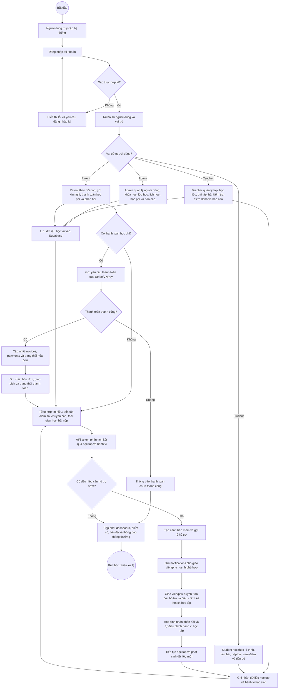

# Activity Diagram Tổng Quan - LMS EdTech Platform

Tài liệu này mô tả luồng xử lý chính của hệ thống LMS EdTech Platform dưới dạng Activity Diagram. Sơ đồ tập trung vào quá trình người dùng đăng nhập, hệ thống phân quyền, người dùng thao tác theo vai trò, dữ liệu được ghi nhận, sau đó hệ thống tổng hợp và phân tích để phục vụ học tập, quản lý, thanh toán và can thiệp sớm.

Vì Mermaid không có ký hiệu Activity Diagram UML đầy đủ như trong các công cụ UML chuyên dụng, tài liệu sử dụng `flowchart` để mô phỏng activity diagram: nút bắt đầu/kết thúc, hành động xử lý, điểm rẽ nhánh và vòng lặp cải thiện.

## 1. Activity Diagram Tổng Quan

## 2. Diễn Giải Luồng Xử Lý

| Bước xử lý | Mô tả nghiệp vụ | Thành phần/bảng tiêu biểu |
| --- | --- | --- |
| Truy cập và đăng nhập | Người dùng vào hệ thống, nhập tài khoản, hệ thống xác thực và lấy thông tin vai trò. | Supabase Auth, `users`, role-based dashboard |
| Phân quyền theo vai trò | Hệ thống điều hướng người dùng đến khu vực phù hợp: Admin, Teacher, Student hoặc Parent. | `app/(dashboard)/admin`, `teacher`, `student`, `parent` |
| Thao tác nghiệp vụ | Mỗi vai trò thực hiện nhóm chức năng riêng: quản trị, dạy học, học tập, theo dõi con hoặc thanh toán. | `classes`, `courses`, `course_items`, `homework`, `exams`, `attendance_records` |
| Ghi nhận dữ liệu | Hệ thống lưu dữ liệu học vụ, học tập, điểm danh, bài nộp, thanh toán và thông báo. | `student_activity_logs`, `student_progress`, `exam_submissions`, `homework_submissions`, `invoices`, `payments`, `notifications` |
| Tổng hợp tín hiệu | Hệ thống tổng hợp các tín hiệu phản ánh quá trình học của học sinh. | Điểm số, tiến độ, chuyên cần, thời gian học, độ trễ nộp bài |
| Phân tích AI/System | AI hoặc logic hệ thống phân tích dữ liệu để tạo nhận xét, gợi ý hoặc phát hiện dấu hiệu cần hỗ trợ. | `quiz_*_analysis`, `student_behavior_scores`, `behavior_alerts` |
| Can thiệp sớm | Khi có dấu hiệu cần hỗ trợ, hệ thống gửi cảnh báo mềm để giáo viên/phụ huynh đồng hành với học sinh. | `notifications`, `behavior_alerts`, báo cáo giáo viên/phụ huynh |
| Vòng lặp cải thiện | Sau khi được hỗ trợ, học sinh tiếp tục học tập; dữ liệu mới lại được ghi nhận để đánh giá tiến triển. | `useActivityTracker`, `/api/activity/log`, `student_activity_logs` |

## 3. Đoạn Mô Tả Có Thể Đưa Vào Báo Cáo

Activity Diagram tổng quan cho thấy luồng xử lý của hệ thống bắt đầu từ việc người dùng truy cập và đăng nhập. Sau khi xác thực thành công, hệ thống tải thông tin hồ sơ, xác định vai trò và điều hướng người dùng đến chức năng tương ứng. Admin tập trung quản trị dữ liệu toàn hệ thống; Teacher tổ chức hoạt động dạy học; Student tham gia học tập và làm bài; Parent theo dõi tình hình học tập của con, gửi xin nghỉ và thanh toán học phí.

Trong quá trình sử dụng, hệ thống ghi nhận dữ liệu học vụ, học tập, điểm danh, bài nộp, điểm số, thanh toán và thông báo vào Supabase. Các dữ liệu này được tổng hợp thành tín hiệu học tập như tiến độ, kết quả, chuyên cần, thời gian học và mức độ tương tác. AI/System tiếp tục phân tích các tín hiệu đó để cập nhật dashboard, tạo thông báo, đưa ra gợi ý học tập hoặc phát hiện dấu hiệu cần hỗ trợ sớm. Khi có dấu hiệu cần hỗ trợ, hệ thống tạo cảnh báo mềm cho giáo viên và phụ huynh, từ đó giúp học sinh nhận phản hồi rõ ràng và tự điều chỉnh hành vi học tập. Luồng này tạo thành một vòng lặp cải thiện liên tục giữa dữ liệu, phân tích, hỗ trợ và tiến bộ của học sinh.

## 4. Ghi Chú Thiết Kế

Sơ đồ này là Activity Diagram ở mức tổng quan, phù hợp cho báo cáo/đồ án. Mục tiêu chính là mô tả trình tự xử lý và các điểm rẽ nhánh quan trọng, không đi sâu vào từng API, từng màn hình hoặc từng bảng phụ. Nếu cần bản kỹ thuật chi tiết hơn, có thể tách tiếp thành các Activity Diagram riêng cho các luồng: đăng nhập, học và nộp bài, điểm danh, xin nghỉ, thanh toán học phí, phân tích AI và can thiệp sớm.
