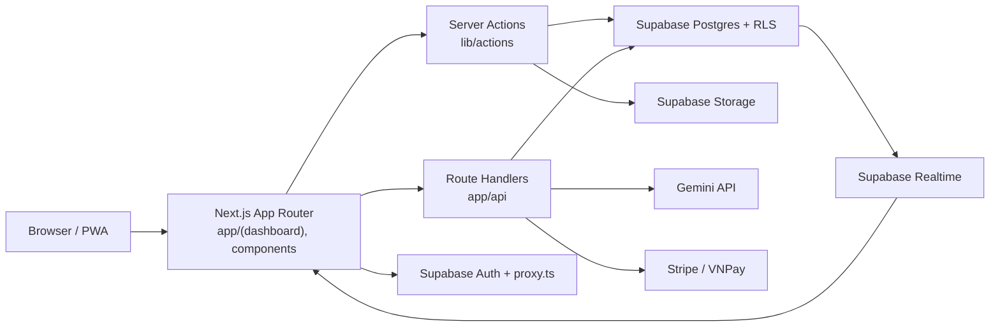

# Architecture - LMS EdTech Platform

Last reviewed: 2026-05-27

## 1. Tổng quan

Codebase hiện là ứng dụng Next.js App Router dùng React 19, TypeScript, Supabase, shadcn/ui, TanStack Query, Zustand, Gemini AI, Stripe, VNPay và PWA. Kiến trúc chính là full-stack Next.js: UI, Server Components, Server Actions và Route Handlers cùng sống trong một repo.

## 2. Các lớp chính

| Lớp | File/thư mục | Trách nhiệm |
|---|---|---|
| Routing/UI | `app/`, `components/` | Trang dashboard theo role, form, bảng, biểu đồ, layout |
| UI primitives | `components/ui/` | shadcn/radix components dùng lại |
| Client hooks | `hooks/` | Auth, realtime, notifications, activity tracking, page tracking |
| Server business logic | `lib/actions/` | Nghiệp vụ Supabase server-side |
| API integration | `app/api/` | AI, payment, notification, activity tracking, webhook/IPN |
| Data clients | `lib/supabase/` | Browser/server/middleware/admin Supabase clients |
| Shared libs | `lib/gemini.ts`, `lib/stripe.ts`, `lib/vnpay.ts` | Tích hợp AI và payment |
| State/cache | `stores/`, `lib/providers/` | Zustand notification/auth store, TanStack Query provider |
| Database | `supabase/`, `types/database.ts` | SQL setup/migrations, generated/manual types |
| Public/PWA | `public/`, `next.config.ts`, `app/manifest.ts` | Icons, service worker, PWA caching |

## 3. Auth và RBAC

`proxy.ts` refresh session bằng `updateSession()` trong `lib/supabase/middleware.ts`, đọc role từ bảng `users` bằng admin client, rồi redirect theo role:

- `admin` -> `/admin`
- `teacher` -> `/teacher`
- `student` -> `/student`
- `parent` -> `/parent`

Route `/api`, `/_next`, static files và manifest được bỏ qua ở proxy. Điều này tốt cho performance, nhưng nghĩa là API routes phải tự kiểm quyền nếu endpoint ghi hoặc đọc dữ liệu nhạy cảm.

## 4. Data access pattern

| Pattern | Khi dùng | Ví dụ |
|---|---|---|
| Browser Supabase client | Client component cần đọc dữ liệu công khai theo RLS hoặc realtime | `lib/supabase/client.ts` |
| Server Supabase client | Server Components, Server Actions, Route Handlers dùng session user | `lib/supabase/server.ts` |
| Admin Supabase client | Tác vụ admin, webhook, system job, bypass RLS có kiểm soát | `lib/supabase/admin.ts` |
| Server Actions | Workflow nội bộ có form/action từ UI | `lib/actions/attendance.ts`, `exam.ts`, `schedule.ts` |
| API Route | Tích hợp ngoài, AI, webhook, tracking event | `app/api/ai/*`, `app/api/payment/*`, `app/api/activity/*` |

Quy tắc: nếu dùng `createAdminClient()`, code phải nằm server-only và phải kiểm quyền trước khi đọc/ghi dữ liệu người khác.

## 5. Module nghiệp vụ

| Module | UI chính | Server logic | Data chính |
|---|---|---|---|
| Auth/Profile | `app/(auth)`, profile pages | `profile.ts`, `admin.ts` | `users`, `profiles` |
| Academic | admin courses/classes, teacher classes | `academic.ts`, `teacher.ts`, `class-students.ts` | `courses`, `classes`, `enrollments` |
| Scheduling | schedule pages, room manager | `schedule.ts`, `class-sessions.ts`, `teacher-leave.ts` | `rooms`, `class_schedules`, `class_sessions`, `teacher_leave_requests` |
| Content | course builder, learn pages | `courseBuilder.ts`, `resourceBank.ts` | `course_items`, `item_contents`, `teacher_resources`, `student_progress` |
| Assessment | homework/exams pages | `homework.ts`, `exam.ts`, `quiz-analysis.ts` | `homework`, `exams`, submissions, AI analysis tables |
| Attendance | attendance pages | `attendance.ts`, `attendance-points.ts`, `point.ts` | `attendance_sessions`, `attendance_records`, `absence_requests`, points |
| Communication | announcements, notifications, feedback | `announcement.ts`, `admin-announcements.ts`, `notifications.ts`, `feedback.ts` | `announcements`, `notifications`, `user_feedback` |
| Parent portal | parent pages | `parentStudent.ts`, `parent-progress.ts`, `parent-views.ts` | `parent_students`, child learning/attendance/payment data |
| Finance | admin finance, parent payments | payment API, `stripe.ts`, `vnpay.ts` | `fee_plans`, `invoices`, `payments` |
| AI/Behavior | analytics pages, AI routes | `gemini.ts`, `behavior-analysis.ts`, `gemini-analysis.ts` | `student_activity_logs`, `student_behavior_scores`, `behavior_alerts` |

## 6. Realtime và cache

Các hook `useRealtime.ts`, `useRealtimeSync.ts`, `useNotifications.ts` và providers trong `lib/providers/` cho thấy hệ thống đang dựa vào Supabase Realtime kết hợp TanStack Query. Khi thêm tính năng realtime:

- Đặt query key ổn định theo entity (`classId`, `studentId`, `examId`).
- Invalidate đúng scope, tránh refetch toàn dashboard.
- Với dữ liệu nhạy cảm, realtime channel phải phù hợp với RLS/policy.

## 7. PWA

`next.config.ts` dùng `next-pwa`, tắt trong development, cache Supabase theo NetworkFirst và static assets theo CacheFirst. Khi thêm PWA/offline:

- Không cache response chứa dữ liệu nhạy cảm lâu hơn cần thiết.
- Không giả định dữ liệu Supabase cached là mới nhất.
- Sau thay đổi manifest/service worker cần test install flow trên mobile.

## 8. Rủi ro kiến trúc cần xử lý trước khi mở rộng mạnh

- Nhiều SQL file theo phase có thể tạo trạng thái DB khó tái lập nếu chạy không đúng thứ tự.
- Một số migration cũ disable RLS hoặc policy quá rộng; cần audit trước production.
- `proxy.ts` bỏ qua `/api`, nên route handlers cần kiểm quyền riêng.
- AI output đang phụ thuộc JSON parsing từ text; cần schema validation chặt hơn ở các flow quan trọng.
- Payment webhook/IPN cần idempotency và audit log tốt hơn trước khi dùng thật.

