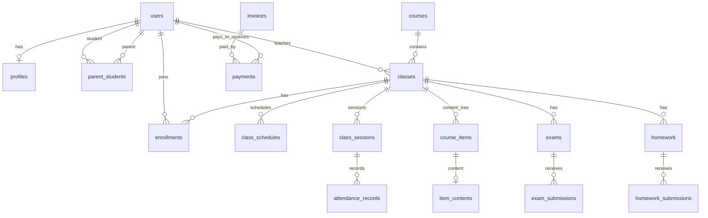

# Database Schema - LMS EdTech Platform

Last reviewed: 2026-05-27

## 1. Nguồn schema

Schema hiện nằm rải rác trong:

- `supabase/seed.sql`
- `supabase/setup_*.sql`
- `supabase/phase_*.sql`
- `supabase/migrations/*.sql`
- `types/database.ts`

Trước khi production, nên hợp nhất thành một migration baseline và các migration tăng dần có thứ tự rõ.

## 2. Nhóm bảng chính

| Nhóm | Bảng tiêu biểu | Ý nghĩa |
|---|---|---|
| Identity/RBAC | `users`, `profiles`, `parent_students` | User app, hồ sơ, quan hệ phụ huynh - học sinh |
| Academic | `courses`, `classes`, `enrollments` | Khóa học, lớp học, ghi danh |
| Scheduling | `rooms`, `class_schedules`, `class_sessions`, `teacher_leave_requests` | Phòng, lịch, buổi học, giáo viên nghỉ/thay thế |
| Content | `class_sections`, `lessons`, `course_items`, `item_contents`, `teacher_resources` | Học liệu, cây bài học, ngân hàng tài nguyên |
| Assessment | `assignments`, `questions`, `submissions`, `homework`, `homework_submissions`, `exams`, `exam_submissions`, `quiz_attempts` | Bài tập, kiểm tra, bài nộp, lịch sử làm quiz |
| Progress/Grades | `student_progress`, `student_class_stats`, `grade_reports`, `grade_notifications`, `student_reviews` | Tiến độ, điểm, báo cáo, nhận xét |
| Attendance | `attendance`, `attendance_sessions`, `attendance_records`, `absence_requests` | Điểm danh cũ/mới, đơn xin nghỉ |
| Gamification | `student_points`, `attendance_points`, `student_achievements` | Điểm thưởng, leaderboard, thành tích |
| Communication | `announcements`, `announcement_reads`, `notifications`, `discussion_messages`, `feedback`, `user_feedback` | Thông báo, đã đọc, tin nhắn, phản hồi |
| Survey | `surveys`, `survey_questions`, `survey_responses` | Khảo sát và câu trả lời |
| Finance | `fee_plans`, `fee_schedules`, `invoices`, `payments` | Học phí, lịch thu, hóa đơn, thanh toán |
| AI/Analytics | `ai_analyses`, `quiz_class_analysis`, `quiz_individual_analysis`, `supplementary_quizzes`, `improvement_progress`, `improvement_quiz_results`, `class_ai_reports` | Kết quả AI, bài bổ trợ, cải thiện |
| Behavior/Tracking | `student_activity_logs`, `user_page_sessions`, `student_behavior_scores`, `behavior_alerts` | Hành vi học tập, phiên truy cập, cảnh báo sớm |

## 3. Quan hệ lõi

## 4. Role và quyền dữ liệu

| Role | Quyền nghiệp vụ mong muốn |
|---|---|
| Admin | Full access qua UI/admin actions; có thể dùng service role server-side |
| Teacher | Chỉ quản lý lớp mình dạy, học sinh trong lớp, học liệu/bài tập/điểm danh của lớp |
| Student | Chỉ xem/làm dữ liệu thuộc lớp mình đã enroll; ghi progress/submission/activity của chính mình |
| Parent | Chỉ xem dữ liệu học sinh đã liên kết trong `parent_students`; tạo absence/feedback/payment cho con |

RLS hiện có nhiều policy ở `supabase/rls-policies.sql` và các file phase. Cần audit vì có file từng `DISABLE ROW LEVEL SECURITY` hoặc policy rộng như `USING (true)`.

## 5. Bảng cần coi là nhạy cảm

- `users`, `profiles`: PII, role, invite code.
- `parent_students`: quan hệ gia đình.
- `exam_submissions`, `homework_submissions`, `grade_reports`, `student_reviews`: điểm và nhận xét.
- `attendance_records`, `absence_requests`: chuyên cần, lý do nghỉ.
- `invoices`, `payments`: tài chính.
- `student_activity_logs`, `user_page_sessions`, `student_behavior_scores`, `behavior_alerts`: hành vi học tập.
- AI analysis tables: có thể chứa nhận xét cá nhân hóa.

## 6. Migration rule

Khi thêm/sửa bảng:

1. Tạo migration trong `supabase/migrations/` với timestamp.
2. Dùng `CREATE TABLE IF NOT EXISTS` hoặc `ALTER TABLE ... ADD COLUMN IF NOT EXISTS` khi phù hợp.
3. Thêm index cho foreign key và các filter thường dùng.
4. Bật RLS trừ khi có lý do kỹ thuật được ghi rõ.
5. Thêm policy cho admin, teacher, student, parent theo phạm vi dữ liệu.
6. Cập nhật `types/database.ts` nếu dùng type thủ công/generated.
7. Cập nhật tài liệu này và `API_SPEC.md` nếu có endpoint liên quan.

## 7. Index đề xuất cần kiểm tra

- `users(role)`, `users(invite_code)`.
- `classes(course_id)`, `classes(teacher_id)`.
- `enrollments(class_id, student_id)` unique nếu chưa có.
- `parent_students(parent_id, student_id)` unique nếu chưa có.
- `class_sessions(class_id, session_date)`.
- `attendance_records(session_id, student_id)`.
- `exam_submissions(exam_id, student_id)`.
- `homework_submissions(homework_id, student_id)`.
- `notifications(user_id, is_read, created_at)`.
- `payments(invoice_id, status)`, `invoices(student_id, status)`.
- `student_activity_logs(student_id, class_id, created_at)`.

## 8. Data integrity checklist

- Không xóa user/class nếu còn dữ liệu quan trọng mà chưa có cascade/soft delete rõ.
- Payment/invoice không được cập nhật từ client không xác thực.
- Submission nên có constraint chống nộp trùng nếu nghiệp vụ chỉ cho một lần nộp.
- AI analysis nên lưu version/model/prompt hash nếu dùng để ra quyết định quan trọng.
- Invite code phải có expiry và không lộ cho user không có quyền.

