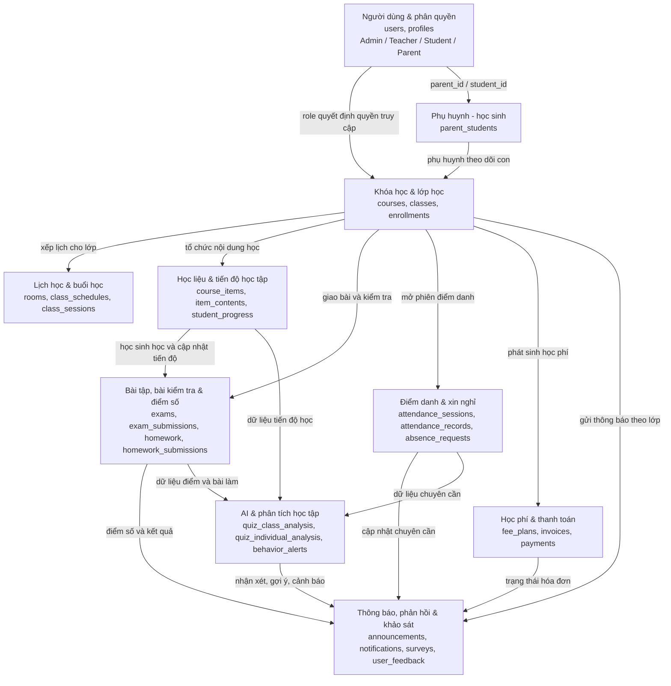

# Mô Hình Dữ Liệu Đơn Giản - LMS EdTech Platform

Tài liệu này mô tả mô hình dữ liệu của hệ thống LMS ở mức tổng quan, phục vụ báo cáo/đồ án. Thay vì trình bày toàn bộ bảng trong cơ sở dữ liệu, mô hình được gom thành các nhóm dữ liệu chính để người đọc dễ hiểu vai trò và mối liên hệ giữa các phần của hệ thống.

## 1. Sơ Đồ Tổng Quan

## 2. Giải Thích Các Nhóm Dữ Liệu

| Nhóm dữ liệu | Bảng tiêu biểu trong codebase | Ý nghĩa nghiệp vụ |
|---|---|---|
| Người dùng & phân quyền | `users`, `profiles` | Lưu thông tin tài khoản và vai trò của người dùng: Admin, Teacher, Student, Parent. Vai trò quyết định người dùng được vào cổng nào và thao tác dữ liệu nào. |
| Phụ huynh - học sinh | `parent_students` | Xác định quan hệ giữa phụ huynh và học sinh để phụ huynh có thể xem lịch học, tiến độ, điểm số, điểm danh và học phí của con. |
| Khóa học & lớp học | `courses`, `classes`, `enrollments` | Là lõi học vụ của hệ thống. Khóa học chứa các lớp; lớp có giáo viên phụ trách; học sinh được ghi danh vào lớp thông qua enrollments. |
| Lịch học & buổi học | `rooms`, `class_schedules`, `class_sessions` | Quản lý phòng học, lịch học cố định và các buổi học cụ thể được sinh ra từ lịch. Đây là dữ liệu nền cho điểm danh và theo dõi lịch học. |
| Học liệu & tiến độ học tập | `course_items`, `item_contents`, `student_progress` | Lưu cây bài học, nội dung học như video/tài liệu/quiz và tiến độ học của từng học sinh trong từng lớp. |
| Bài tập, bài kiểm tra & điểm số | `exams`, `exam_submissions`, `homework`, `homework_submissions` | Quản lý việc giáo viên giao bài, tạo bài kiểm tra, học sinh làm bài/nộp bài và hệ thống lưu kết quả, điểm số, phản hồi. |
| Điểm danh & xin nghỉ | `attendance_sessions`, `attendance_records`, `absence_requests` | Ghi nhận trạng thái đi học của học sinh theo từng buổi và xử lý đơn xin nghỉ do phụ huynh gửi. |
| Thông báo, phản hồi & khảo sát | `announcements`, `notifications`, `surveys`, `user_feedback` | Là kênh giao tiếp giữa trung tâm, giáo viên, học sinh và phụ huynh. Hệ thống dùng nhóm này để gửi thông báo, thu phản hồi và khảo sát. |
| Học phí & thanh toán | `fee_plans`, `invoices`, `payments` | Quản lý kế hoạch học phí, hóa đơn của học sinh và trạng thái thanh toán qua VNPay hoặc Stripe. |
| AI & phân tích học tập | `quiz_class_analysis`, `quiz_individual_analysis`, `behavior_alerts` | Sử dụng dữ liệu điểm số, tiến độ, chuyên cần và hành vi học tập để tạo phân tích, nhận xét, gợi ý ôn tập hoặc cảnh báo sớm. |

## 3. Mô Tả Có Thể Đưa Vào Báo Cáo

Mô hình dữ liệu của hệ thống LMS được tổ chức xoay quanh người dùng và lớp học. Mỗi người dùng có một vai trò cụ thể như quản trị viên, giáo viên, học sinh hoặc phụ huynh. Từ vai trò này, hệ thống xác định phạm vi dữ liệu mà người dùng được truy cập và thao tác.

Trung tâm quản lý hoạt động học vụ thông qua các nhóm dữ liệu khóa học, lớp học, lịch học và buổi học. Giáo viên sử dụng các dữ liệu này để tổ chức lớp, xây dựng học liệu, giao bài tập, tạo bài kiểm tra và điểm danh. Học sinh tham gia lớp học, học theo lộ trình, làm bài và được ghi nhận tiến độ, điểm số, chuyên cần. Phụ huynh được liên kết với học sinh để theo dõi quá trình học tập của con, nhận thông báo, gửi đơn xin nghỉ và thanh toán học phí.

Bên cạnh các dữ liệu vận hành chính, hệ thống còn có nhóm dữ liệu giao tiếp, tài chính và AI. Nhóm giao tiếp giúp gửi thông báo, khảo sát và tiếp nhận phản hồi. Nhóm tài chính quản lý hóa đơn và thanh toán. Nhóm AI khai thác dữ liệu học tập, điểm số và chuyên cần để tạo phân tích, nhận xét cá nhân hóa, gợi ý ôn tập và cảnh báo sớm. Nhờ cách tổ chức này, hệ thống không chỉ lưu trữ dữ liệu học tập mà còn hỗ trợ quản lý trung tâm và ra quyết định dựa trên dữ liệu.

## 4. Cách Đọc Mô Hình

- `users` là điểm bắt đầu vì mọi dữ liệu đều gắn với một người dùng hoặc vai trò.
- `classes` là trung tâm của dữ liệu học vụ vì lớp học liên kết giáo viên, học sinh, lịch học, học liệu, bài kiểm tra, điểm danh và học phí.
- `parent_students` giúp phụ huynh xem dữ liệu của con mà không cần trực tiếp tham gia lớp.
- `quiz_class_analysis` và `quiz_individual_analysis` không thay thế giáo viên, mà đóng vai trò hỗ trợ phân tích và gợi ý.
- Mô hình này là bản rút gọn để giải thích tổng quan; khi triển khai kỹ thuật chi tiết có thể mở rộng thành ERD đầy đủ với khóa chính và khóa ngoại.
