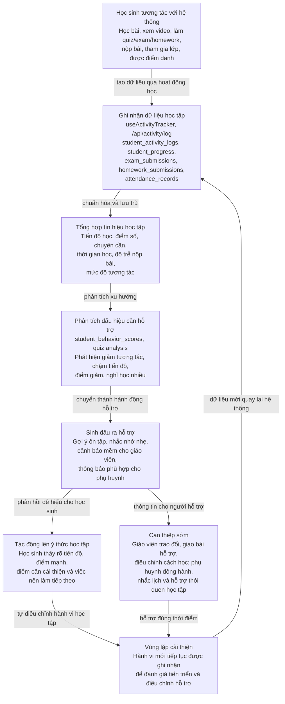

# Mô Hình Quy Trình Dữ Liệu Đến Can Thiệp Sớm Cho Học Sinh

Tài liệu này mô tả cách dữ liệu học tập của học sinh được ghi nhận, phân tích và chuyển hóa thành các hành động hỗ trợ giáo dục. Mục tiêu của mô hình không phải là kỷ luật hay đánh giá tiêu cực học sinh, mà là phát hiện sớm các dấu hiệu cần hỗ trợ để giáo viên, phụ huynh và chính học sinh có thể điều chỉnh kịp thời.

## 1. Sơ Đồ Quy Trình Tổng Quan

## 2. Giải Thích 5 Lớp Trong Quy Trình

| Lớp quy trình | Dữ liệu hoặc thành phần tiêu biểu | Vai trò trong can thiệp sớm |
|---|---|---|
| Dữ liệu đầu vào | Học bài, xem video, trả lời câu hỏi, nộp bài, tham gia kiểm tra, điểm danh | Đây là các hành động thật của học sinh trong quá trình học. Mỗi hành động tạo ra dấu vết dữ liệu giúp hệ thống hiểu học sinh đang học như thế nào. |
| Lưu trữ dữ liệu | `student_activity_logs`, `student_progress`, `exam_submissions`, `homework_submissions`, `attendance_records` | Hệ thống lưu lại dữ liệu theo từng học sinh, lớp học và hoạt động học tập. Dữ liệu này là nền tảng để theo dõi tiến trình thay vì chỉ nhìn vào kết quả cuối cùng. |
| Phân tích tín hiệu | `student_behavior_scores`, `quiz_class_analysis`, `quiz_individual_analysis`, `behavior_alerts` | Hệ thống tổng hợp các tín hiệu như điểm số giảm, tiến độ chậm, ít tương tác, nghỉ học nhiều hoặc nộp bài muộn để phát hiện dấu hiệu cần hỗ trợ. |
| Tác động nhận thức học sinh | Gợi ý ôn tập, nhắc nhở, phản hồi tiến độ, thông báo nhiệm vụ tiếp theo | Học sinh được nhìn thấy tình trạng học tập của mình một cách rõ ràng hơn. Điều này giúp các em tự nhận ra điểm mạnh, điểm yếu và chủ động điều chỉnh hành vi học tập. |
| Can thiệp sớm bởi giáo viên/phụ huynh | `notifications`, dashboard giáo viên, cổng phụ huynh, phản hồi của giáo viên | Giáo viên và phụ huynh nhận được thông tin vừa đủ để hỗ trợ đúng lúc: trao đổi với học sinh, giao bài bổ trợ, nhắc lịch học hoặc cùng xây dựng thói quen học tập ổn định. |

## 3. Mô Tả Có Thể Đưa Vào Báo Cáo

Mô hình quy trình dữ liệu của hệ thống LMS được thiết kế theo hướng tạo ra một vòng lặp hỗ trợ học tập liên tục. Khi học sinh tương tác với hệ thống như học bài, xem video, làm bài kiểm tra, nộp bài tập hoặc tham gia điểm danh, các dữ liệu này được ghi nhận và lưu trữ theo từng học sinh, từng lớp học và từng hoạt động cụ thể.

Từ dữ liệu thô, hệ thống tổng hợp thành các tín hiệu học tập có ý nghĩa hơn như tiến độ hoàn thành bài học, xu hướng điểm số, mức độ chuyên cần, thời gian học, độ trễ khi nộp bài và mức độ tương tác. Các tín hiệu này giúp hệ thống phát hiện sớm những biểu hiện cần hỗ trợ, chẳng hạn học sinh giảm tương tác, chậm tiến độ, điểm số đi xuống hoặc nghỉ học nhiều.

Kết quả phân tích không nhằm gắn nhãn tiêu cực cho học sinh, mà được chuyển hóa thành các hành động hỗ trợ nhẹ nhàng. Hệ thống có thể đưa ra gợi ý ôn tập, nhắc nhở nhiệm vụ, cảnh báo mềm cho giáo viên hoặc thông báo phù hợp cho phụ huynh. Qua đó, học sinh được nhìn thấy rõ hơn tình trạng học tập của bản thân, hiểu mình cần cải thiện ở đâu và có động lực tự điều chỉnh hành vi học tập.

Điểm quan trọng của mô hình là sự can thiệp sớm của con người. Giáo viên vẫn là người đưa ra quyết định sư phạm cuối cùng, còn phụ huynh đóng vai trò đồng hành trong việc hình thành thói quen học tập. Sau mỗi hành động hỗ trợ, hành vi mới của học sinh tiếp tục được ghi nhận, tạo thành một vòng lặp cải thiện liên tục giữa dữ liệu, phân tích, phản hồi và can thiệp.

## 4. Ý Nghĩa Giáo Dục Của Quy Trình

- Học sinh không chỉ nhận điểm số, mà còn nhận được tín hiệu phản hồi để hiểu quá trình học của mình.
- Giáo viên không cần chờ đến khi kết quả học tập giảm mạnh mới phát hiện vấn đề.
- Phụ huynh có thông tin kịp thời để đồng hành thay vì chỉ biết kết quả sau cùng.
- Hệ thống AI đóng vai trò hỗ trợ phân tích, không thay thế quyết định của giáo viên.
- Can thiệp sớm giúp học sinh điều chỉnh ý thức học tập trước khi khoảng cách kiến thức trở nên quá lớn.

## 5. Liên Hệ Với Codebase Hiện Tại

| Thành phần trong hệ thống | Vai trò trong quy trình |
|---|---|
| `useActivityTracker` | Ghi nhận hành vi học tập trên các trang học, quiz, exam, homework hoặc video. |
| `/api/activity/log` | Nhận dữ liệu hoạt động từ client và lưu theo dạng batch vào hệ thống. |
| `student_activity_logs` | Lưu dữ liệu hoạt động thô của học sinh. |
| `student_behavior_scores` | Lưu điểm/tín hiệu tổng hợp sau khi phân tích hành vi học tập. |
| `behavior_alerts` | Lưu các cảnh báo mềm khi hệ thống phát hiện dấu hiệu cần hỗ trợ. |
| `notifications` | Gửi thông báo đến giáo viên, phụ huynh hoặc học sinh tùy theo ngữ cảnh hỗ trợ. |
