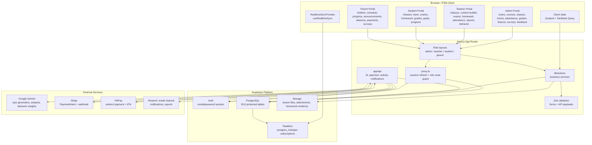
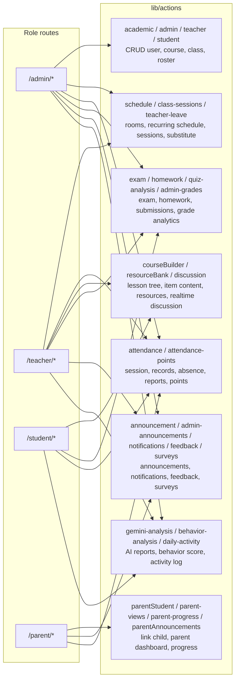
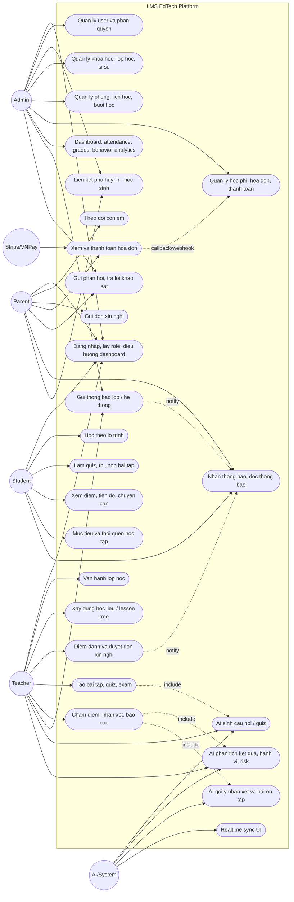
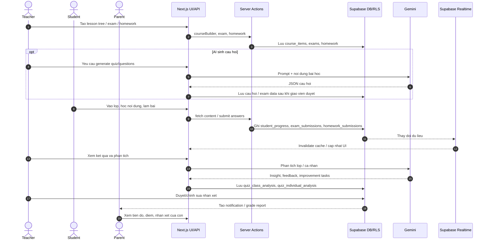
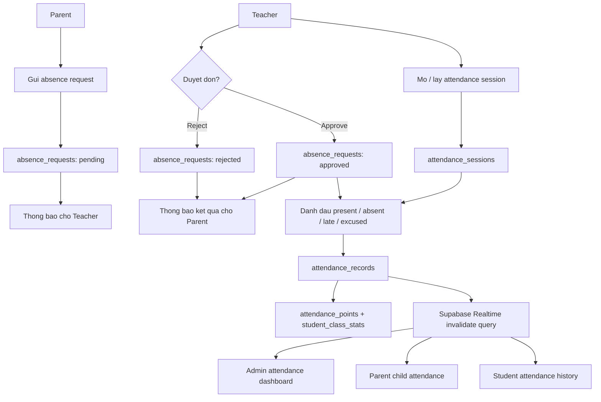
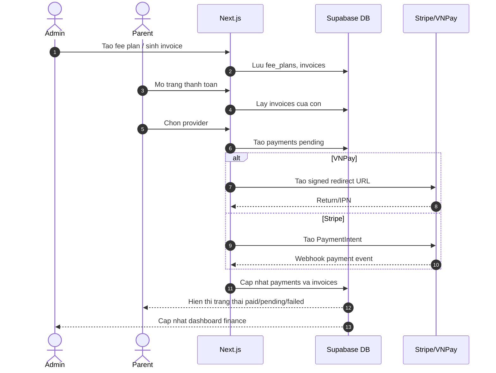

# Mo hinh UML va Use Case - LMS EdTech Platform

Tai lieu nay tong hop tu codebase hien tai: `package.json`, route tree trong `app/`, 35 module `lib/actions`, 20 API route, Supabase SQL migrations, `types/database.ts`, cac provider/hook realtime va tai lieu nghiep vu trong `docs/`.

Ghi chu hien trang: README co noi Next.js 14, nhung `package.json` hien dang dung `next@16.1.6` va `react@19.2.3`. Cac so do ben duoi uu tien hien trang code.

## 1. UML kien truc ky thuat

## 2. UML lop du lieu mien chinh

```mermaid
classDiagram
    direction LR

    class User {
        uuid id
        string email
        UserRole role
        string full_name
        string phone
        string avatar_url
    }

    class Profile {
        uuid id
        uuid user_id
        date date_of_birth
        string address
        string bio
    }

    class ParentStudent {
        uuid id
        uuid parent_id
        uuid student_id
    }

    class Course {
        uuid id
        string name
        string description
        uuid teacher_id
    }

    class LmsClass {
        uuid id
        uuid course_id
        uuid teacher_id
        string name
        string room
        string status
        int max_students
    }

    class Enrollment {
        uuid id
        uuid student_id
        uuid class_id
        EnrollmentStatus status
    }

    class Room {
        uuid id
        string name
        int capacity
    }

    class ClassSchedule {
        uuid id
        uuid class_id
        uuid room_id
        int day_of_week
        time start_time
        time end_time
    }

    class ClassSession {
        uuid id
        uuid class_id
        date session_date
        string topic
        string status
        uuid substitute_teacher_id
    }

    class CourseItem {
        uuid id
        uuid class_id
        uuid parent_id
        string title
        string type
        int order_index
        bool is_published
    }

    class ItemContent {
        uuid item_id
        string content_type
        string content_url
        json content_data
    }

    class StudentProgress {
        uuid id
        uuid student_id
        uuid item_id
        string status
        float progress
    }

    class Lesson {
        uuid id
        uuid class_id
        string title
        string video_url
        int order
    }

    class Assignment {
        uuid id
        uuid lesson_id
        string title
        AssignmentType type
        timestamp deadline
        numeric max_score
        bool ai_graded
    }

    class Question {
        uuid id
        uuid assignment_id
        string content
        json options
        string correct_answer
        numeric points
    }

    class Submission {
        uuid id
        uuid student_id
        uuid assignment_id
        string content_url
        numeric score
    }

    class Exam {
        uuid id
        uuid class_id
        uuid created_by
        string title
        int duration_minutes
        timestamp due_date
    }

    class ExamSubmission {
        uuid id
        uuid exam_id
        uuid student_id
        json answers
        numeric score
        string status
    }

    class Homework {
        uuid id
        uuid class_id
        uuid created_by
        string title
        timestamp due_date
    }

    class HomeworkSubmission {
        uuid id
        uuid homework_id
        uuid student_id
        uuid graded_by
        string file_url
        numeric score
    }

    class AttendanceSession {
        uuid id
        uuid class_id
        uuid teacher_id
        date session_date
        string status
    }

    class AttendanceRecord {
        uuid id
        uuid session_id
        uuid student_id
        AttendanceStatus status
        uuid marked_by
    }

    class AbsenceRequest {
        uuid id
        uuid student_id
        uuid parent_id
        uuid class_id
        date start_date
        date end_date
        string status
    }

    class Notification {
        uuid id
        uuid user_id
        string title
        string type
        bool read
    }

    class Announcement {
        uuid id
        uuid class_id
        uuid teacher_id
        string title
        string file_url
        string video_url
        json quiz_data
    }

    class AnnouncementRead {
        uuid id
        uuid announcement_id
        uuid user_id
        timestamp read_at
    }

    class Survey {
        uuid id
        uuid created_by
        uuid class_id
        uuid course_id
        string title
        bool is_active
    }

    class SurveyQuestion {
        uuid id
        uuid survey_id
        string question_text
        string question_type
    }

    class SurveyResponse {
        uuid id
        uuid survey_id
        uuid question_id
        uuid user_id
        json answer
    }

    class Invoice {
        uuid id
        uuid student_id
        uuid class_id
        uuid fee_plan_id
        numeric amount
        string status
    }

    class Payment {
        uuid id
        uuid invoice_id
        uuid user_id
        numeric amount
        string provider
        string status
    }

    class QuizClassAnalysis {
        uuid id
        uuid exam_id
        uuid class_id
        uuid teacher_id
        json strengths
        json weaknesses
        string status
    }

    class QuizIndividualAnalysis {
        uuid id
        uuid submission_id
        uuid student_id
        uuid exam_id
        json knowledge_gaps
        string status
    }

    class StudentActivityLog {
        uuid id
        uuid student_id
        uuid class_id
        string activity_type
        json metadata
    }

    class StudentBehaviorScore {
        uuid id
        uuid student_id
        uuid class_id
        numeric score
        string risk_level
    }

    class BehaviorAlert {
        uuid id
        uuid student_id
        uuid class_id
        string severity
        string status
    }

    User "1" --> "0..1" Profile : has
    User "1" --> "0..*" ParentStudent : parent
    User "1" --> "0..*" ParentStudent : student
    ParentStudent "*" --> "1" User : parent_id
    ParentStudent "*" --> "1" User : student_id

    User "1" --> "0..*" Course : teaches
    Course "1" --> "0..*" LmsClass : contains
    User "1" --> "0..*" LmsClass : assigned_teacher
    LmsClass "1" --> "0..*" Enrollment : has
    User "1" --> "0..*" Enrollment : enrolled_student
    Room "1" --> "0..*" ClassSchedule : hosts
    LmsClass "1" --> "0..*" ClassSchedule : scheduled_by
    LmsClass "1" --> "0..*" ClassSession : generates

    LmsClass "1" --> "0..*" CourseItem : contains
    CourseItem "1" --> "0..*" CourseItem : parent_child
    CourseItem "1" --> "0..1" ItemContent : content
    CourseItem "1" --> "0..*" StudentProgress : tracked_by
    User "1" --> "0..*" StudentProgress : student

    LmsClass "1" --> "0..*" Lesson : legacy_lessons
    Lesson "1" --> "0..*" Assignment : has
    Assignment "1" --> "0..*" Question : has
    Assignment "1" --> "0..*" Submission : receives
    User "1" --> "0..*" Submission : submits

    LmsClass "1" --> "0..*" Exam : has
    Exam "1" --> "0..*" ExamSubmission : receives
    User "1" --> "0..*" ExamSubmission : takes
    LmsClass "1" --> "0..*" Homework : has
    Homework "1" --> "0..*" HomeworkSubmission : receives
    User "1" --> "0..*" HomeworkSubmission : submits

    LmsClass "1" --> "0..*" AttendanceSession : has
    AttendanceSession "1" --> "0..*" AttendanceRecord : contains
    User "1" --> "0..*" AttendanceRecord : marked_student
    User "1" --> "0..*" AbsenceRequest : parent_or_student
    LmsClass "1" --> "0..*" AbsenceRequest : requested_for

    User "1" --> "0..*" Notification : receives
    LmsClass "1" --> "0..*" Announcement : has
    Announcement "1" --> "0..*" AnnouncementRead : read_tracking
    User "1" --> "0..*" AnnouncementRead : reads

    Survey "1" --> "0..*" SurveyQuestion : has
    SurveyQuestion "1" --> "0..*" SurveyResponse : answered_by
    User "1" --> "0..*" SurveyResponse : respondent

    User "1" --> "0..*" Invoice : student
    Invoice "1" --> "0..*" Payment : paid_by
    User "1" --> "0..*" Payment : payer

    Exam "1" --> "0..1" QuizClassAnalysis : class_ai_report
    ExamSubmission "1" --> "0..1" QuizIndividualAnalysis : individual_ai_report
    User "1" --> "0..*" StudentActivityLog : activity
    User "1" --> "0..*" StudentBehaviorScore : behavior
    StudentBehaviorScore "1" --> "0..*" BehaviorAlert : may_trigger
```

## 3. Phan he nghiep vu theo module code

## 4. Use Case diagram tong the

Mermaid khong co native use-case diagram, nen so do nay bieu dien theo dang actor + use case boundary.

## 5. Quy trinh hoc tap va danh gia

## 6. Quy trinh diem danh va xin nghi

## 7. Quy trinh thanh toan hoc phi

## 8. Tom tat actor va pham vi chinh

| Actor | Pham vi chinh trong code |
|---|---|
| Admin | Quan ly user, khoa hoc, lop hoc, phong, lich, diem danh, diem so, thong bao, khao sat, feedback, finance, behavior dashboard |
| Teacher | Quan ly lop, hoc lieu, lich day, diem danh, don nghi, bai tap, exam, AI analysis, nhan xet, bao cao, hanh vi hoc tap |
| Student | Xem lop, hoc lesson tree, lam quiz/exam/homework, xem diem, tien do, chuyen can, muc tieu/thoi quen, thong bao |
| Parent | Lien ket con em, xem dashboard con, lich hoc, diem/tien do, thong bao, xin nghi, thanh toan, feedback, khao sat |
| AI/System | Gemini generation/analysis, realtime sync, activity tracking, behavior scoring, payment callback/webhook, notification fan-out |

## 9. Bang mien du lieu chinh

| Mien | Bang tieu bieu |
|---|---|
| Core identity | `users`, `profiles`, `parent_students` |
| Academic operation | `courses`, `classes`, `enrollments`, `rooms`, `class_schedules`, `class_sessions`, `teacher_leave_requests` |
| Learning content | `course_items`, `item_contents`, `student_progress`, `teacher_resources`, `discussion_messages`, `lessons` |
| Assessment | `assignments`, `questions`, `submissions`, `exams`, `exam_submissions`, `homework`, `homework_submissions`, `grade_notifications`, `student_reviews` |
| Attendance | `attendance_sessions`, `attendance_records`, `absence_requests`, `attendance_points`, `student_class_stats`, `student_achievements` |
| Communication | `announcements`, `announcement_reads`, `notifications`, `user_feedback`, `surveys`, `survey_questions`, `survey_responses` |
| Finance | `fee_plans`, `fee_schedules`, `invoices`, `payments` |
| AI / analytics | `quiz_class_analysis`, `quiz_individual_analysis`, `supplementary_quizzes`, `improvement_progress`, `student_activity_logs`, `student_behavior_scores`, `behavior_alerts`, `class_ai_reports`, `user_page_sessions` |
