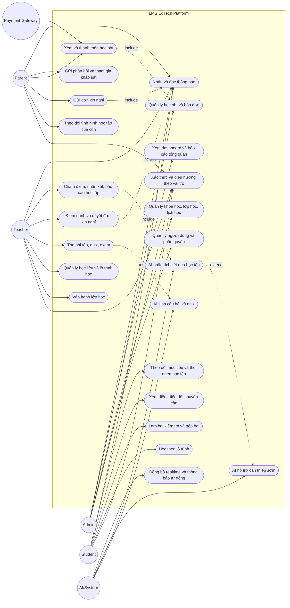

# Use Case Diagram Tổng Quan - LMS EdTech Platform

Tài liệu này mô tả các nhóm người dùng chính và các chức năng lớn của hệ thống LMS EdTech Platform dưới dạng Use Case Diagram tổng quan. Vì Mermaid chưa hỗ trợ trực tiếp ký hiệu UML Use Case chuẩn, sơ đồ dưới đây dùng `flowchart` để mô phỏng: actor được biểu diễn bằng nút tròn, use case được biểu diễn bằng nút bo góc, và phần `LMS EdTech Platform` đóng vai trò system boundary.

## 1. Use Case Diagram Tổng Quan

## 2. Giải Thích Actor

| Actor | Vai trò trong hệ thống | Nhóm chức năng liên quan |
| --- | --- | --- |
| Admin | Quản trị toàn bộ hệ thống, dữ liệu học vụ và vận hành. | Người dùng, khóa học, lớp học, phòng học, lịch học, điểm danh, điểm số, tài chính, khảo sát, phản hồi, hành vi học tập. |
| Teacher | Tổ chức hoạt động dạy học và theo dõi quá trình học của học sinh. | Lớp học, học liệu, bài tập, bài kiểm tra, điểm danh, chấm điểm, báo cáo, cảnh báo hành vi học tập. |
| Student | Tham gia học tập, làm bài và theo dõi kết quả cá nhân. | Lớp học, lộ trình học, bài tập, bài kiểm tra, bài nộp, điểm số, tiến độ, lịch học. |
| Parent | Theo dõi quá trình học của con và phối hợp với nhà trường. | Tiến độ học tập, lịch học, điểm danh, đơn xin nghỉ, học phí, thông báo, phản hồi. |
| AI/System | Hỗ trợ tự động hóa, phân tích dữ liệu học tập và cảnh báo mềm. | Sinh câu hỏi, phân tích quiz/exam, phân tích hành vi học tập, thông báo realtime, hỗ trợ can thiệp sớm. |
| Payment Gateway | Hệ thống bên ngoài xử lý giao dịch thanh toán học phí. | Thanh toán qua Stripe/VNPay, cập nhật trạng thái hóa đơn và giao dịch. |

## 3. Giải Thích Use Case Chính

| Nhóm use case | Nội dung nghiệp vụ | Actor chính |
| --- | --- | --- |
| Xác thực và phân quyền | Người dùng đăng nhập, hệ thống xác định vai trò và điều hướng đến dashboard phù hợp. | Admin, Teacher, Student, Parent |
| Quản trị học vụ | Quản lý người dùng, khóa học, lớp học, phòng học, lịch học và dữ liệu tổng quan. | Admin |
| Vận hành lớp học | Giáo viên quản lý học liệu, bài tập, bài kiểm tra, điểm danh, nhận xét và báo cáo lớp. | Teacher |
| Học tập của học sinh | Học sinh học theo lộ trình, xem nội dung, làm bài, nộp bài, xem điểm và theo dõi tiến độ. | Student |
| Đồng hành của phụ huynh | Phụ huynh xem tình hình học tập của con, gửi đơn xin nghỉ, thanh toán học phí và phản hồi với hệ thống. | Parent |
| AI và phân tích học tập | Hệ thống sinh câu hỏi, phân tích kết quả, phát hiện dấu hiệu cần hỗ trợ và tạo cảnh báo mềm cho giáo viên/phụ huynh. | AI/System, Teacher, Parent |
| Thanh toán học phí | Phụ huynh xem hóa đơn, chọn phương thức thanh toán và hệ thống cập nhật trạng thái giao dịch qua cổng thanh toán. | Parent, Payment Gateway, Admin |
| Thông báo | Hệ thống gửi thông báo về lịch học, điểm danh, học phí, phản hồi, cảnh báo mềm và các thay đổi quan trọng. | Admin, Teacher, Student, Parent, AI/System |

## 4. Ghi Chú Khi Đưa Vào Báo Cáo

Use Case Diagram tổng quan cho thấy hệ thống LMS EdTech Platform được sử dụng bởi nhiều nhóm actor với mục tiêu khác nhau. Admin chịu trách nhiệm quản trị dữ liệu và vận hành toàn hệ thống; Teacher trực tiếp tổ chức lớp học, giao bài, kiểm tra và theo dõi kết quả; Student tương tác với hệ thống để học tập, làm bài và xem tiến độ; Parent theo dõi quá trình học của con, gửi xin nghỉ, thanh toán học phí và phản hồi; AI/System hỗ trợ sinh câu hỏi, phân tích dữ liệu học tập và đề xuất can thiệp sớm; Payment Gateway là hệ thống ngoài phục vụ xử lý thanh toán. Các quan hệ `include` và `extend` trong sơ đồ được dùng ở mức tổng quan để thể hiện một số chức năng có liên kết chặt chẽ, không đi sâu vào từng màn hình hoặc API chi tiết.
