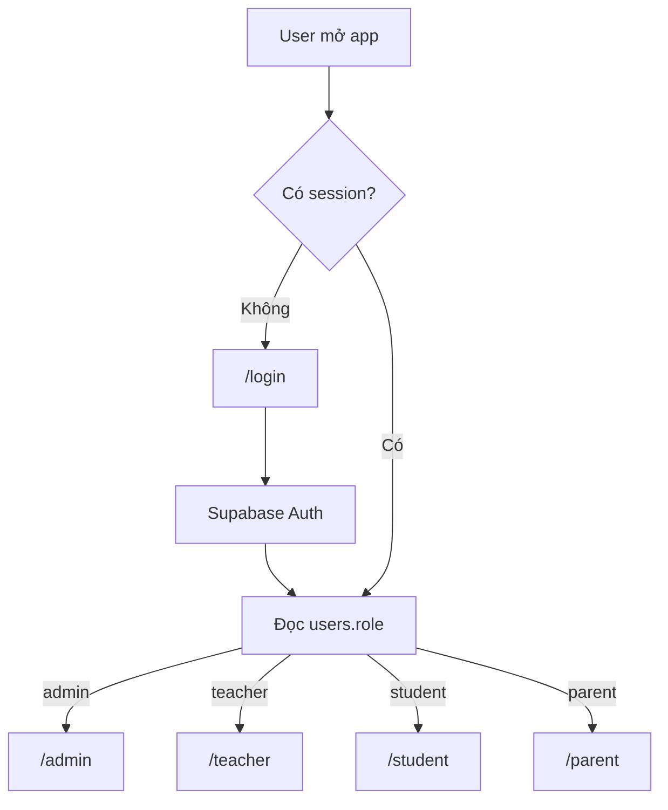

# UX Flows - LMS EdTech Platform

Last reviewed: 2026-05-27

## 1. Nguyên tắc UX

- Người dùng sau đăng nhập phải được đưa đúng portal theo role.
- Mỗi màn hình nghiệp vụ cần có loading, empty, success và error state.
- Những thao tác ghi dữ liệu quan trọng phải có xác nhận hoặc khả năng hoàn tác khi hợp lý.
- Admin cần giao diện dày thông tin, dễ lọc, dễ export.
- Teacher cần workflow nhanh trong lớp: học liệu, điểm danh, giao bài, chấm bài.
- Student cần tập trung vào việc học tiếp theo, hạn nộp và feedback.
- Parent cần ngôn ngữ rõ ràng, ít thuật ngữ kỹ thuật, tập trung vào tình hình của con.

## 2. Flow đăng nhập và điều hướng

Acceptance criteria:

- User chưa login vào dashboard sẽ bị redirect về `/login?redirectTo=...`.
- User đã login vào `/login` sẽ bị redirect về dashboard đúng role.
- User cố vào route role khác sẽ bị redirect về dashboard của mình.

## 3. Admin flows

### Quản lý user

1. Admin mở `/admin/users`.
2. Lọc theo role hoặc tìm kiếm.
3. Tạo/sửa/xóa user hoặc xem chi tiết user.
4. Với student/parent, có thể liên kết phụ huynh - học sinh.

Data chính: `users`, `profiles`, `parent_students`.

Trạng thái cần có: empty list, import lỗi, user đã tồn tại, không thể xóa user đang có dữ liệu liên kết.

### Quản lý học vụ

1. Admin tạo course ở `/admin/courses`.
2. Admin tạo class ở `/admin/classes`, gán teacher, course, thời gian.
3. Admin ghi danh học sinh vào class.
4. Admin hoặc Teacher sinh lịch học/buổi học.

Data chính: `courses`, `classes`, `enrollments`, `rooms`, `class_schedules`, `class_sessions`.

### Quản lý tài chính

1. Admin mở `/admin/finance`.
2. Xem invoice/payment theo trạng thái.
3. Tạo hoặc cập nhật khoản thu.
4. Đối soát Stripe/VNPay/manual transfer.

Data chính: `fee_plans`, `fee_schedules`, `invoices`, `payments`.

## 4. Teacher flows

### Vận hành lớp

1. Teacher mở `/teacher/classes`.
2. Chọn class detail `/teacher/classes/[id]`.
3. Xem học sinh, lịch, nội dung, điểm danh, homework/exam, điểm.
4. Gửi announcement hoặc feedback khi cần.

### Tạo học liệu

1. Teacher vào `/teacher/classes/[id]/content`.
2. Tạo section/item bằng course builder.
3. Thêm content: text, video, file, link, quiz.
4. Publish để student nhìn thấy.

Data chính: `course_items`, `item_contents`, `teacher_resources`.

### Tạo và chấm bài

1. Teacher tạo homework hoặc exam.
2. Student làm bài và submit.
3. Hệ thống lưu submission.
4. Teacher xem analytics, chấm thủ công phần cần chấm.
5. Teacher gửi feedback/grade notification.

Data chính: `homework`, `homework_submissions`, `exams`, `exam_submissions`, `grade_notifications`.

### Điểm danh

1. Teacher chọn class và ngày học.
2. Hệ thống get-or-create attendance session.
3. Teacher cập nhật trạng thái từng student.
4. Hệ thống lưu records, cập nhật points/notifications nếu có.

Data chính: `attendance_sessions`, `attendance_records`, `attendance_points`, `absence_requests`.

## 5. Student flows

### Học theo lớp

1. Student mở `/student/classes`.
2. Chọn class `/student/classes/[id]`.
3. Vào learn tree `/student/classes/[id]/learn`.
4. Mở item, học nội dung, làm quiz nếu có.
5. Hệ thống cập nhật progress và activity logs.

Data chính: `enrollments`, `course_items`, `item_contents`, `student_progress`, `student_activity_logs`.

### Làm exam/homework

1. Student mở assignment/exam từ dashboard hoặc class.
2. Hệ thống kiểm tra quyền: student phải thuộc class.
3. Student submit answers/files.
4. Hệ thống lưu submission, tính điểm phần tự động nếu có.
5. Student xem kết quả khi teacher/system cho phép.

## 6. Parent flows

### Liên kết học sinh

1. Parent mở `/parent/link-student`.
2. Nhập invite code hoặc được admin liên kết.
3. Hệ thống tạo `parent_students`.
4. Parent xem dashboard con.

### Theo dõi con

1. Parent mở `/parent` hoặc `/parent/children/[id]/progress`.
2. Xem lịch, chuyên cần, điểm, tiến độ, nhận xét.
3. Gửi xin nghỉ, feedback hoặc xem học phí.

Data chính: `parent_students`, attendance/submission/progress/payment data theo student.

## 7. AI flows

### Sinh câu hỏi/quiz

1. Teacher nhập yêu cầu hoặc chọn content.
2. API `/api/ai/generate-questions` hoặc `/api/ai/generate-quiz` gọi Gemini.
3. Hệ thống parse JSON, trả câu hỏi để teacher duyệt.
4. Teacher lưu vào exam/content/resource.

### Phân tích bài kiểm tra

1. Teacher mở analytics của exam.
2. API phân tích class hoặc individual.
3. Kết quả lưu vào `quiz_class_analysis`, `quiz_individual_analysis`.
4. Teacher xem, chỉnh, approve hoặc gửi feedback/bài bổ trợ.

## 8. UX debt cần ưu tiên

- Chuẩn hóa empty states cho các bảng lớn: users, classes, exams, payments, feedback.
- Chuẩn hóa error toast khi Supabase/API/AI lỗi.
- Thêm state "AI đang xử lý" rõ ràng cho batch analysis.
- Với payment, luôn hiển thị trạng thái giao dịch và hướng dẫn khi pending/failed.
- Với mobile/PWA, kiểm tra bottom navigation và sidebar theo từng role.

